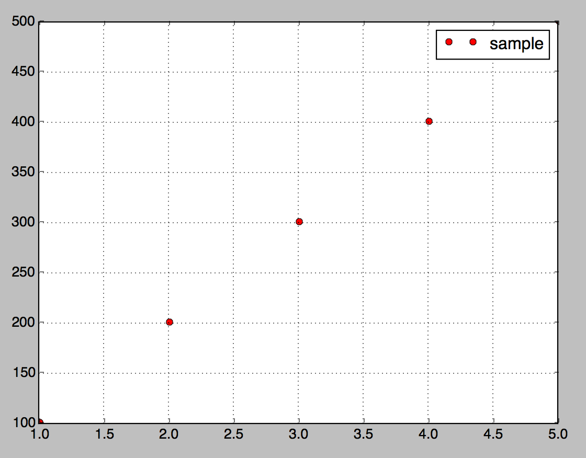

# Explotter

explotter is a wrapper for https://github.com/JordiPolo/explot.

I added the following features:

* support plot method
```
plotter = Explotter.new
a = [1,2,3,4,5]
b = [100, 200, 300, 400, 500]
Explotter.plot(plotter, a, b, :ro, [label: "sample"])
Explotter.show(plotter)
```

result is:



## Installation

If [available in Hex](https://hex.pm/docs/publish), the package can be installed
by adding `explotter` to your list of dependencies in `mix.exs`:

```elixir
def deps do
  [
    {:explotter, "~> 0.1.0"}
  ]
end
```

Documentation can be generated with [ExDoc](https://github.com/elixir-lang/ex_doc)
and published on [HexDocs](https://hexdocs.pm). Once published, the docs can
be found at [https://hexdocs.pm/explotter](https://hexdocs.pm/explotter).
